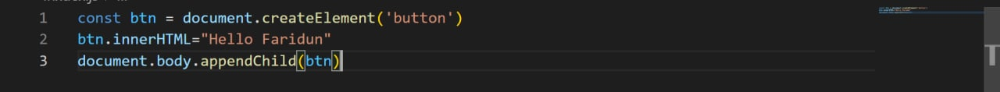
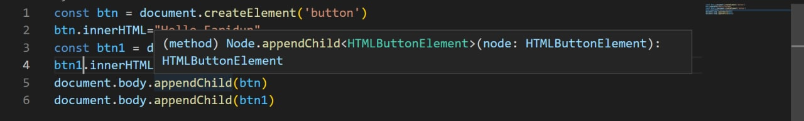
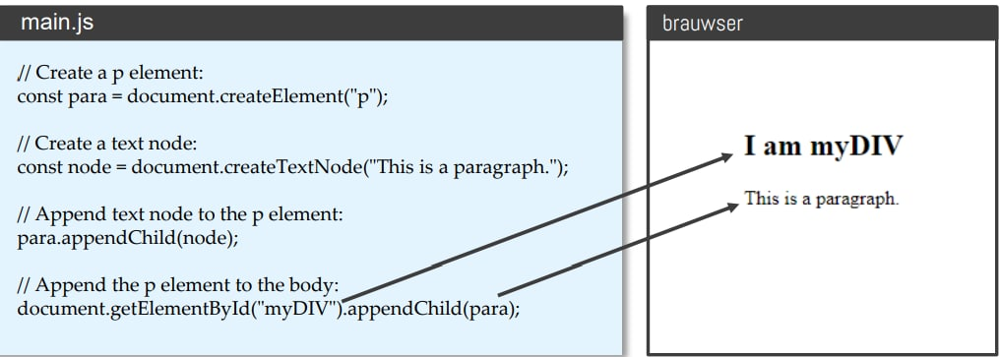
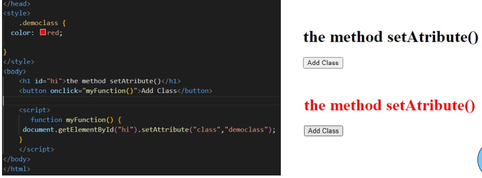

# Dom
## (Document object Model)
### createElement()
#### The JavaScript document.createElement() method allows you to create and return a  new element (an empty Element node) with the specified tag name

##### 1) createElement(elementName): Creates an html element whose tag is passed as a parameter. Returns the created element
##### 2) createTextNode(text): Creates and returns a text node. The node text is passed as a parameter.

## The createElement() Methods

# The createElement() method creates an element node.

## HTML DOM Element appendChild()

### The appendChild() method appends a node (element) as the last child of an element.appendChild() adds a node to the end of the list of children of the specified parent node. If the given child element is a reference to an existing node in the document, then the appendChild()  function moves it from its current position to the new position

# appendChild()
# To create a paragraph with a text.
•Create a paragraph element
•Create a text node
•Append the text node to the paragraph
•Append the paragraph to the document.

# classlist()
## ClassList is a getter. The object it returns has several methods:
add( String [,String] ) 
Adds the specified classes to the element
remove( String [,String] ) 
Removes the specified classes from the element
item (Number) 
The result is similar to calling classList[Number]
toggle(String[, Boolean]) 
If the element has no class, it adds it, otherwise it removes it. When
false is passed as the second parameter, it removes the specified
class, and if true, it adds it.
If the second parameter is undefined or a variable with
typeof == 'undefined', the behavior is the same as passing only the
first parameter when calling

# SetAtributte
## The setAttribute() method sets a new value to an attribute. If the attribute does not exist, it is created first.
